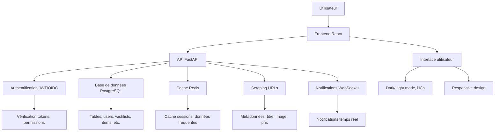

# Architecture

## Vue d'ensemble

```
wisherr/
├── backend/                # API FastAPI (Python 3.11)
│   ├── app/
│   │   ├── auth/          # Authentification & autorisation (JWT, OIDC)
│   │   ├── wishlists/     # CRUD listes, collaborateurs, settings
│   │   ├── items/         # CRUD articles, réservations, achats
│   │   ├── shares/        # Partage interne/externe, tokens
│   │   ├── groups/        # Groupes/familles, membres
│   │   ├── notifications/ # Notifications temps réel
│   │   ├── activities/    # Fil d'activité, logs d'audit
│   │   ├── admin/         # Panel admin, stats, config
│   │   ├── public/        # Endpoints publics (site info)
│   │   ├── scrape/        # Scraping métadonnées URL
│   │   ├── core/          # DB, cache, rate limiting, utils
│   │   └── tests/         # Tests unitaires pytest
│   ├── pyproject.toml     # Dépendances Poetry
│   └── Dockerfile         # Image backend production
├── frontend/              # React 19 + TypeScript
│   ├── src/
│   │   ├── features/      # Modules par fonctionnalité
│   │   │   ├── auth/      # Login, register, profil
│   │   │   ├── wishlists/ # Listes, création, édition
│   │   │   ├── items/     # Articles, réservations
│   │   │   ├── shares/    # Partage, permissions
│   │   │   ├── groups/    # Groupes, membres
│   │   │   ├── notifications/ # Notifications UI
│   │   │   ├── dashboard/ # Tableau de bord
│   │   │   └── admin/     # Admin UI
│   │   ├── shared/        # Composants partagés, utils, store
│   │   ├── routes/        # Routing React Router
│   │   └── index.css      # Thème Tailwind CSS
│   ├── package.json       # Dépendances npm
│   └── Dockerfile.prod    # Image frontend nginx
├── db/
│   ├── schema.sql         # Schéma PostgreSQL initial
│   ├── migrations/        # Migrations Alembic
│   └── data/              # Volume données PostgreSQL (gitignored)
├── .github/
│   └── workflows/         # CI/CD GitHub Actions
├── .gitlab-ci.yml         # CI/CD GitLab (lint, test, docker, deploy)
├── docker-compose.yml     # Orchestration services
└── .env.example           # Template variables d'environnement
```

## Stack Technique

### Backend
- **Framework** : FastAPI 0.110+ (Python 3.11)
- **ORM** : SQLModel (type-safe, async support)
- **Base de données** : PostgreSQL 15
- **Cache** : Redis 5.0 (optionnel)
- **Auth** : python-jose (JWT), Authlib (OIDC)
- **Validation** : Pydantic 2.5 (email, data models)
- **Rate limiting** : SlowAPI
- **Scraping** : BeautifulSoup4, Requests
- **Monitoring** : prometheus-client 0.16.0
- **Tests** : pytest, httpx, pytest-asyncio

### Frontend
- **Framework** : React 19 + TypeScript 4.9
- **Routing** : React Router DOM 7.12
- **State Management** : Zustand 5.0
- **UI Library** : Material-UI 7.3 (@mui/material)
- **Styling** : Tailwind CSS 3.4, @emotion/styled
- **Icônes** : Lucide React 0.562
- **i18n** : i18next 22.4, react-i18next
- **HTTP Client** : Axios 1.13
- **Build Tool** : Craco 7.1, React Scripts 5.0

### DevOps & Infrastructure
- **Conteneurisation** : Docker, Docker Compose
- **CI/CD** : GitHub Actions, GitLab CI
- **Tests** : pytest (backend), Jest (frontend)
- **Linting** : Ruff (Python), ESLint (TypeScript)
- **Sécurité** : Bandit (SAST Python)

## Base de données

### Tables principales
- **users** : Utilisateurs (id, username, email, password_hash, oidc_sub, is_admin, locale)
- **wishlists** : Listes de souhaits (id, owner_id, title, description, image_url, is_public, share_password_hash)
- **wishlist_collaborators** : Collaborateurs (id, wishlist_id, user_id, role: owner/editor/viewer)
- **items** : Articles (id, wishlist_id, name, url, image_url, description, price, category_id, priority_id, status, sort_order)
- **item_reservations** : Réservations (id, item_id, reserved_by_user_id, reserved_by_name, reserved_at, purchased_at)
- **wishlist_shares** : Partages (id, wishlist_id, share_type: internal/external, target_type, target_id, token, password_hash, permission, expires_at)
- **groups** : Groupes/familles (id, name, description, owner_id, visibility)
- **group_members** : Membres de groupe (id, group_id, user_id, role: admin/member, joined_at)
- **notifications** : Notifications (id, user_id, type, title, message, is_read, related_id, created_at)
- **activities** : Activités (id, user_id, action_type, wishlist_id, item_id, details, created_at)
- **item_categories** : Catégories personnalisées (id, name, color, icon)
- **item_priorities** : Priorités (id, name, level, color, icon)

### Index optimisés
- Index sur `users.username`, `users.email`, `users.oidc_sub`
- Index sur `wishlists.owner_id`, `items.wishlist_id`
- Index composés pour performances (collaborators, reservations)

## Diagramme de fonctionnement

