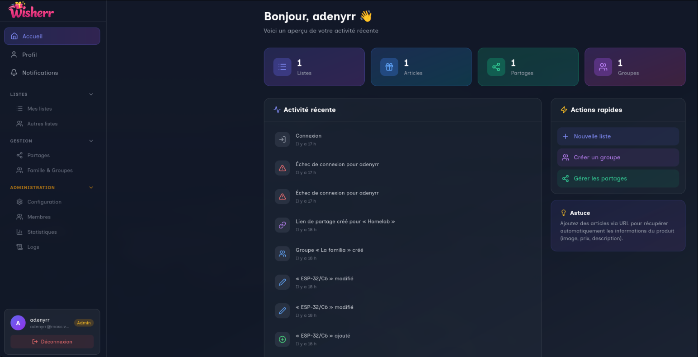
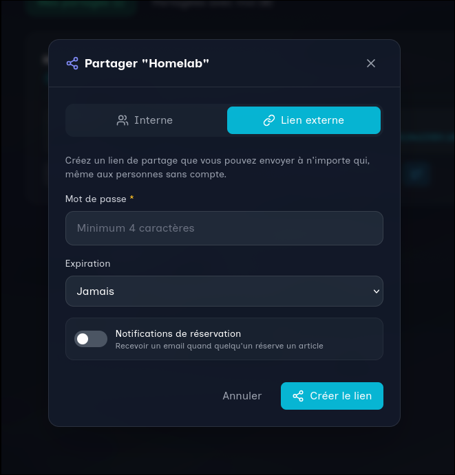

<div align="center">


---

[](LICENSE)
[](INSTALLATION.md)
[](https://www.python.org/)
[](https://reactjs.org/)
[](https://www.postgresql.org/)
[](https://fastapi.tiangolo.com/)

*Une application web moderne et complète pour créer, gérer et partager vos listes de souhaits*

[🚀 Installation](INSTALLATION.md) • [📖 Documentation](USAGE.md) • [🔧 API](API.md) • [🏗️ Architecture](ARCHITECTURE.md) • [🗺️ Roadmap](ROADMAP.md)

---

</div>

Une application web moderne et complète pour créer, gérer et partager vos listes de souhaits. Wisherr permet aux utilisateurs de créer des listes de cadeaux, de les partager avec leurs proches (famille, amis, groupes), et d'éviter les doublons grâce aux réservations privées.

## ✨ Fonctionnalités principales

- 🔐 **Authentification sécurisée** : Locale (username/password) ou OIDC/SSO avec JWT
- 📝 **Gestion de listes** : CRUD complet avec permissions granulaires (owner/editor/viewer)
- 🎯 **Articles détaillés** : Scraping automatique, catégories, priorités, réservations privées
- 👥 **Partage flexible** : Interne (utilisateurs/groupes) ou externe (liens publics)
- 🏘️ **Groupes & familles** : Organisation des proches avec gestion de membres
- 🔔 **Notifications temps réel** : Réservations, partages, activités
- 🌍 **Internationalisation** : Français et Anglais
- 🎨 **Interface moderne** : Dark/Light mode, responsive, Glassmorphism
- 📊 **Monitoring complet** : Métriques Prometheus, health checks, logs
- 🛡️ **Administration** : Panel admin avec stats, gestion utilisateurs, config

## 📚 Documentation

- **[Installation & Démarrage](INSTALLATION.md)** - Guide complet d'installation (Docker recommandé)
- **[Utilisation](USAGE.md)** - Premiers pas, guides par rôle, fonctionnalités avancées
- **[API Documentation](API.md)** - Tous les endpoints avec exemples
- **[Architecture](ARCHITECTURE.md)** - Vue d'ensemble technique et diagramme
- **[Roadmap](ROADMAP.md)** - Fonctionnalités présentes et à venir
- **[Contributing](CONTRIBUTING.md)** - Guide de contribution et développement

## 🚀 Installation rapide

### Prérequis
- Docker 20.10+ et Docker Compose 2.0+

### Démarrage
```bash
git clone https://github.com/votre-org/wisherr.git
cd wisherr
cp .env.example .env
# Éditer .env pour changer SECRET_KEY
docker compose up -d --build
```

Accès :
- **Frontend** : http://localhost:8080
- **API Docs** : http://localhost:8000/docs
- **Métriques** : http://localhost:8000/metrics

Premier utilisateur admin créé automatiquement (voir `.env`).

## 🔒 Sécurité

- Rate limiting sur endpoints sensibles
- Validation stricte des mots de passe
- JWT sécurisé avec SECRET_KEY obligatoire
- CORS configuré
- Logs structurés JSON
- Audit logs pour traçabilité

## 📞 Support

- 🐛 **Issues** : [GitHub Issues](https://github.com/votre-org/wisherr/issues)
- 💬 **Discussions** : [GitHub Discussions](https://github.com/votre-org/wisherr/discussions)
- 📖 **Documentation** : Voir les liens ci-dessus

## 📄 Licence

CC BY-NC : adenyrr - Voir [LICENSE](LICENSE)

## 👥 Équipe

- **Architecture & Backend** : [@architecte-logiciel](agents)
- **DevOps & Infrastructure** : [@sre-devops](agents)
- **Sécurité** : [@analyse-securite-code](agents)
- **Documentation** : [@documentation-support](agents)

## 📸 Screenshots


- **Dashboard**

  

- **Créer une liste**

  

- **Ajouter un article**

  

- **Partage public / Lien**

  


---
