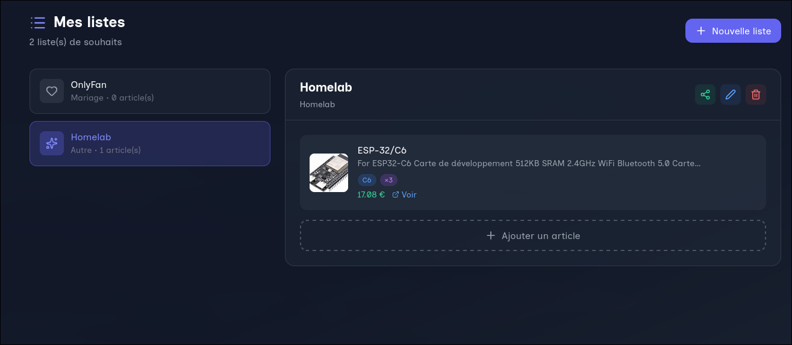
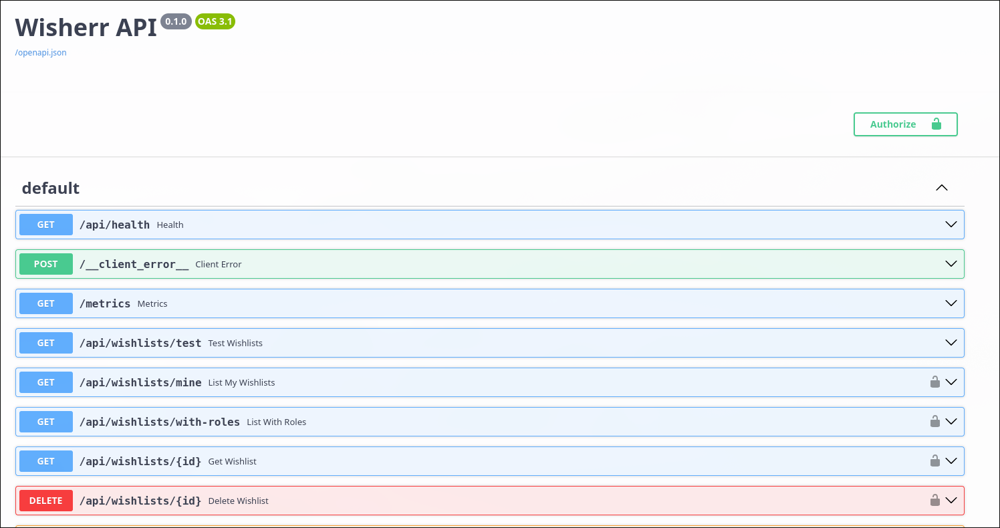
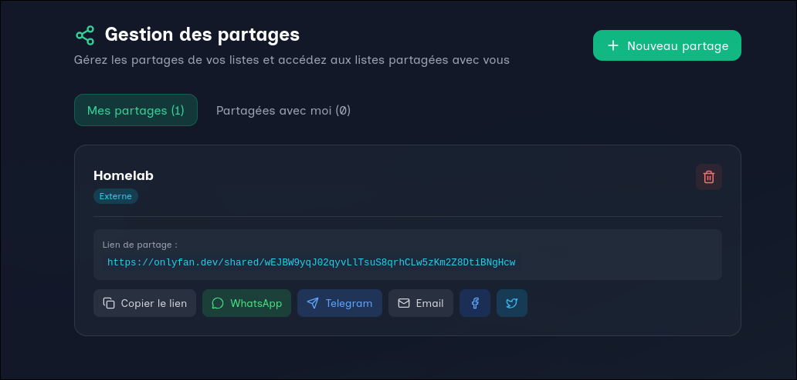

<div align="center">


---

[](LICENSE)
[](INSTALLATION.md)
[](https://www.python.org/)
[](https://reactjs.org/)
[](https://www.postgresql.org/)
[](https://fastapi.tiangolo.com/)

*A modern, full-featured web app to create, manage and share your wishlists*

[🚀 Installation](INSTALLATION.md) • [📖 Documentation](USAGE.md) • [🔧 API](API.md) • [🏗️ Architecture](ARCHITECTURE.md) • [🗺️ Roadmap](ROADMAP.md)<br />
## • [Version française](README.md) •

---

</div>

> ⚡ **Note :** This application was *vibe-coded* — prototyped with multiples agents and LLM.

A modern, full-featured web app to create, manage and share your wishlists. Wisherr allows users to create wishlists, share them with friends and family (groups), and avoid duplicates using private reservations.

## ✨ Main features

- 🔐 **Secure authentication**: Local (username/password) or OIDC/SSO with JWT
- 📝 **List management**: Full CRUD with granular permissions (owner/editor/viewer)
- 🎯 **Detailed items**: Automatic scraping, categories, priorities, private reservations
- 👥 **Flexible sharing**: Internal (users/groups) or external (public links)
- 🏘️ **Groups & families**: Organize your close ones and manage members
- 🔔 **Real-time notifications**: Reservations, shares, activities
- 🌍 **Internationalization**: French and English
- 🎨 **Modern UI**: Dark/Light modes, responsive, glassmorphism
- 📊 **Full monitoring**: Prometheus metrics, health checks, logs
- 🛡️ **Administration**: Admin panel with stats, user management, config

## 📚 Documentation

- **[Installation & Getting Started](INSTALLATION.md)** - Full setup guide (Docker recommended)
- **[Usage](USAGE.md)** - Getting started, role guides, advanced features
- **[API Documentation](API.md)** - All endpoints with examples
- **[Architecture](ARCHITECTURE.md)** - Technical overview and diagrams
- **[Roadmap](ROADMAP.md)** - Features available and planned
- **[Contributing](CONTRIBUTING.md)** - Contribution & development guide

## 🚀 Quick start

### Prerequisites
- Docker 20.10+ and Docker Compose 2.0+

### Start
```bash
# Download configuration files from the repository
curl -fsSL -o compose.yaml https://raw.githubusercontent.com/adenyrr/wisherr/refs/heads/master/compose.yaml
curl -fsSL -o .env.example https://raw.githubusercontent.com/adenyrr/wisherr/refs/heads/master/.env.example

# Copy and configure
cp .env.example .env
nano .env

# Start the stack (uses Docker Hub images defined in compose.yaml)
docker compose up -d
```

Access:
- **Frontend**: http://localhost:8080
- **API Docs**: http://localhost:8000/docs
- **Metrics**: http://localhost:8000/metrics

An initial admin user is created automatically (see `.env`).

## 🔒 Security

- Rate limiting on sensitive endpoints
- Strict password validation
- Secure JWT-based auth with required SECRET_KEY
- Configured CORS
- Structured JSON logs
- Audit logs for accountability

## 📞 Support

- 🐛 **Issues**: [GitHub Issues](https://github.com/votre-org/wisherr/issues)
- 💬 **Discussions**: [GitHub Discussions](https://github.com/votre-org/wisherr/discussions)
- 📖 **Docs**: See links above

## 📄 License

CC BY-NC: adenyrr - See [LICENCE](LICENCE)

## 👥 Team

- **Architecture & Backend**: [@architecte-logiciel](./github/agents)
- **DevOps & Infrastructure**: [@sre-devops](./github/agents)
- **Security**: [@analyse-securite-code](./github/agents)
- **Documentation**: [@documentation-support](./github/agents)

---

## 📸 Screenshots

<div style="display:flex;flex-wrap:wrap;gap:12px;justify-content:center;align-items:flex-start;">
  <figure style="width:220px;margin:0;">
    <a href="assets/dashboard_fr.webp"></a>
    <figcaption style="text-align:center;font-size:0.9rem;margin-top:6px">Dashboard</figcaption>
  </figure>

  <figure style="width:220px;margin:0;">
    <a href="assets/addlist_fr.webp"></a>
    <figcaption style="text-align:center;font-size:0.9rem;margin-top:6px">Create a list</figcaption>
  </figure>

  <figure style="width:220px;margin:0;">
    <a href="assets/additem_fr.webp"></a>
    <figcaption style="text-align:center;font-size:0.9rem;margin-top:6px">Add an item</figcaption>
  </figure>

  <figure style="width:220px;margin:0;">
    <a href="assets/sharing_fr.webp"></a>
    <figcaption style="text-align:center;font-size:0.9rem;margin-top:6px">Public share / Link</figcaption>
  </figure>

  <figure style="width:220px;margin:0;">
    <a href="assets/backend_API.webp"></a>
    <figcaption style="text-align:center;font-size:0.9rem;margin-top:6px">API Backend (admin)</figcaption>
  </figure>

  <figure style="width:220px;margin:0;">
    <a href="assets/shared_fr.webp"></a>
    <figcaption style="text-align:center;font-size:0.9rem;margin-top:6px">Shared list</figcaption>
  </figure>
</div>

> Click a thumbnail to open the full-size image.

---
